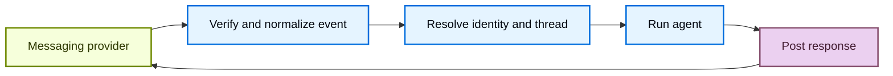

import ManagedDeepAgentsPublicBetaNote from '/snippets/langsmith/managed-deep-agents-public-beta-note.mdx';

A channel makes a managed deep agent available in an external messaging service. Messages from the service can start agent runs, and the agent's final responses return through the same service.

<ManagedDeepAgentsPublicBetaNote />

Put channel declarations under `channels/` at the project root:

:::python
```text
my-agent/
  agent.py
  channels/
    slack.py
```
:::

:::js
```text
my-agent/
  agent.ts
  channels/
    slack.ts
```
:::

For the full project layout, see [Project structure](/langsmith/managed-deep-agents-project-structure).

## Understand channels

A channel combines three parts of an external messaging integration:

- **Inbound events**: Verify and normalize provider events, then start an agent run.
- **Outbound messaging**: Send the agent's response back to the originating conversation.
- **Provisioning**: Create and configure the provider resources that connect the service to the deployed agent.

In Managed Deep Agents, a channel connects a deployed agent to a messaging provider.

The managed runtime handles the channel lifecycle:



Provider adapters determine which events are accepted, how provider conversations map to Managed Deep Agents threads, and how responses are delivered. The channel declaration exposes the supported configuration for that provider.

## Add a channel

Use a channel when people should start agent runs from an external messaging service.

Put each channel in a separate module under `channels/`.

:::python
Export a module-level `channel` from each file.
:::

:::js
Export a named `channel` from each file.
:::

The file name becomes the configured channel name and identifies the channel within the deployment.

:::python
Do not name a declaration `channels/channel.py`.
:::

:::js
Do not name a declaration `channels/channel.ts`.
:::

Channel names must be unique within a project.

The provider factory creates the declaration.

:::python
For example, `channels.slack()` creates a Slack channel.
:::

:::js
For example, `channels.slack()` creates a Slack channel.
:::

See the provider guide for its declaration, app configuration, and deployment procedure.

## Supported channels

<CardGroup cols={2}>
  <Card title="Slack" icon="brand-slack" href="/langsmith/managed-deep-agents-channels-slack">
    Start runs from Slack mentions, direct messages, and thread replies.
  </Card>
</CardGroup>

## Deployment

`mda deploy` discovers channel modules under `channels/` and provisions provider resources from each declaration. See the provider guide for authorization and post-deploy steps.

## When to use channels

| Goal | Use |
| --- | --- |
| Make the agent available in a messaging service | Channels |
| Load tools from a remote MCP server | [MCP connectors](/langsmith/managed-deep-agents-mcp-connectors) |
| Authenticate callers and scope channel runs | [Identity](/langsmith/managed-deep-agents-identity) |
| Deliver scheduled results through a channel | [Schedules](/langsmith/managed-deep-agents-schedules) |

For more information, see [Project structure](/langsmith/managed-deep-agents-project-structure).
